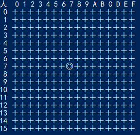

# 五子棋
使用nodejs实现控制台人机对战五子棋，人先着，一方赢后停止交互。

相关算法对应文件：
- abnegamax.mjs 负极值α-β剪枝算法
- drawBoard.mjs 绘制局面
- getScore.mjs 计算局面评分
- main.mjs 程序入口
- Nod.mjs 节点类 启发式搜索

对应文章解析 https://segmentfault.com/a/1190000042430368